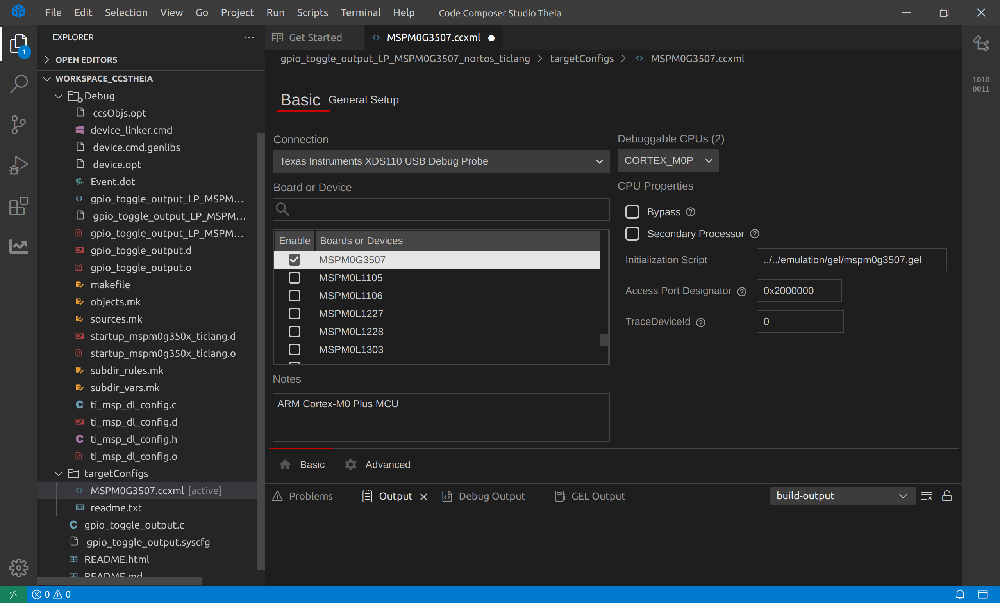
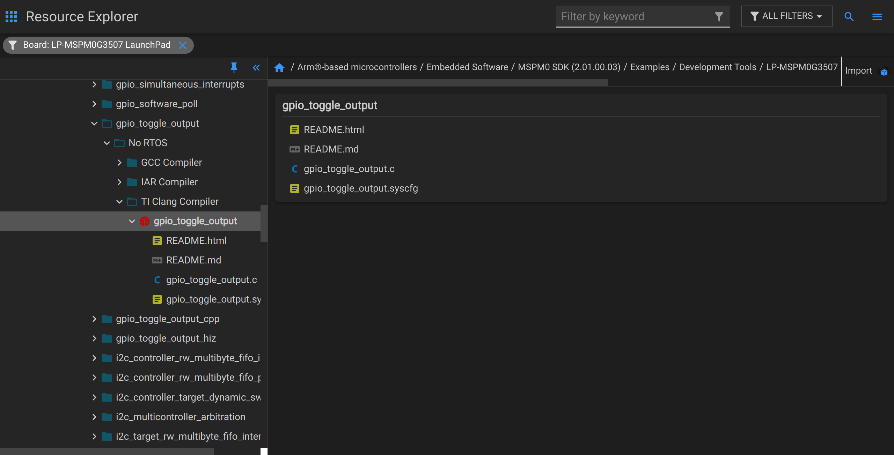
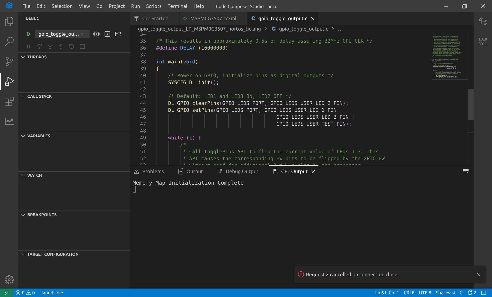
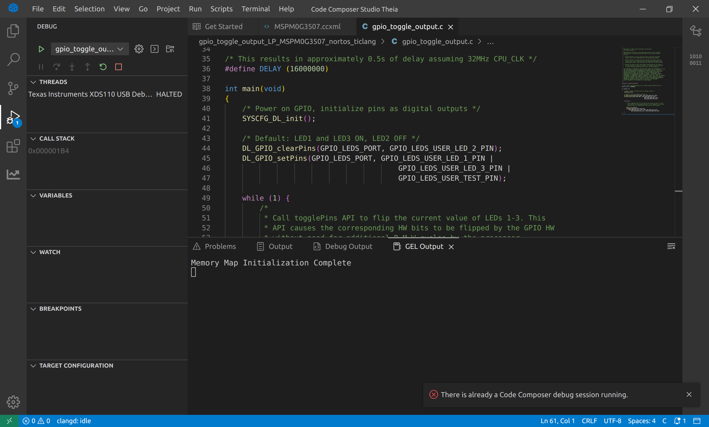
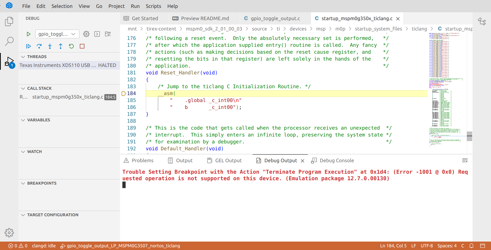

## Unable to Debug after Flashing: There is already a Code Composer debug session running

### Problem Description

On the local CCS-Theia, I can only program once, and subsequent debugging attempts fail. If I click debug a second time, an error message appears: `There is already a Code Composer debug session running.`

However, everything works fine on [CCS Cloud](https://dev.ti.com/ide), which is very strange.

### Environment

- Microcontroller: MSPM0-G3507
- Operating System: Ubuntu-22.04
- CCS-Theia Version: 1.4.1.00001_linux-x64
- Emulator: XDS110
- MSPM0-SDK: 2_01_00_03
- Compiler: TI Clang v3.2.2.LTS

The basic environment is shown below:

### Specific Error and Process

Importing the sample project as shown below:

After clicking debug for the first time, it seems to program successfully, but debugging does not seem to run properly.

Ending the debug session results in the error: `Request 2 cancelled on connection close`

Clicking debug again produces the following error:
`There is already a Code Composer debug session running.`

Restarting CCS-Theia has no effect, and the issue repeats itself.

However, on CCS Cloud, I can successfully program and debug, although the process is slower.

In fact, I found similar issues on TI's Chinese forum, but there were few responses:

[mspm0g3507-ccs-theia-debug](https://e2echina.ti.com/support/microcontrollers/other/f/other-microcontrollers-forum/859832/mspm0g3507-ccs-theia-debug?tisearch=e2e-sitesearch&keymatch=debug#)

[mspm0g3507-debug-there-is-already-a-code-composer-debug-session-running](https://e2echina.ti.com/support/microcontrollers/other/f/other-microcontrollers-forum/860922/mspm0g3507-debug-there-is-already-a-code-composer-debug-session-running?tisearch=e2e-sitesearch&keymatch=debug#)

### Attempted Solutions

None have had a significant effect.

- Restarted CCS-Theia
- Restarted the computer
- Reinstalled CCS-Theia

### Potential Issues

When I first downloaded CCS-Theia, I ran `ccstheia141/ccs/install_scripts/install_drivers.sh` only after CCS-Theia was installed and the project was compiled.

I tried deleting CCS-Theia and running `install_drivers.sh` first, as well as `sudo apt install libc6-i386 libusb-0.1-4 libgconf-2-4 libncurses5 libpython2.7 libtinfo` to reinstall it, but I cannot guarantee a completely clean deletion.

I also tried using the `xds110` program in `ccstheia141/ccs/ccs_base/common/uscif/xds110` to reprogram `firmware_3.0.0.29.bin`, but it did not help.

How can this issue be resolved? Any help would be greatly appreciated!
