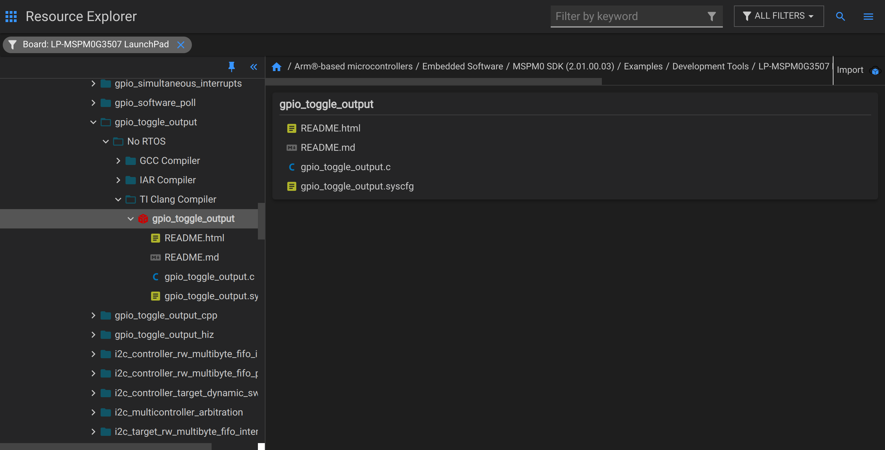
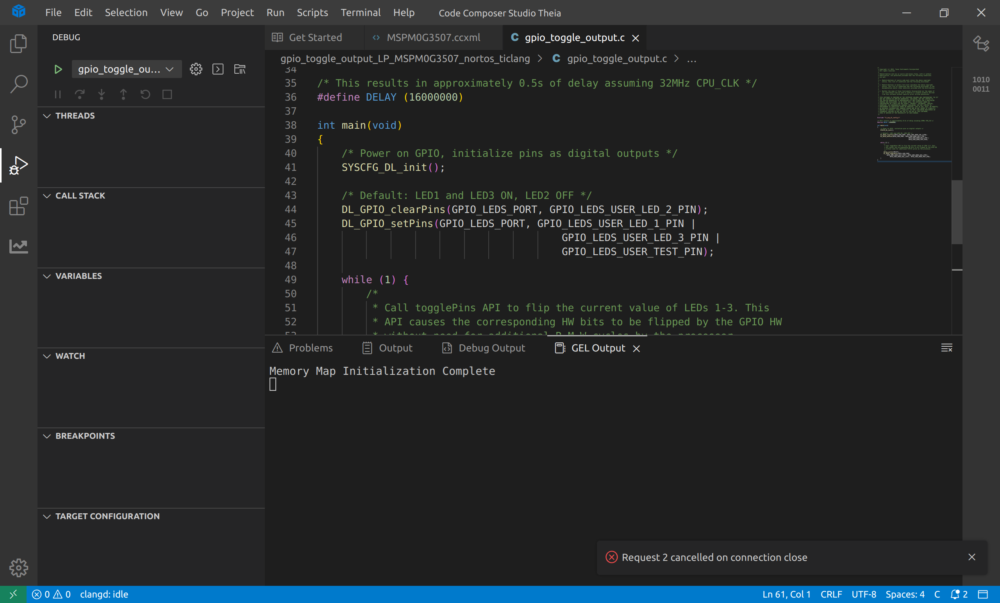
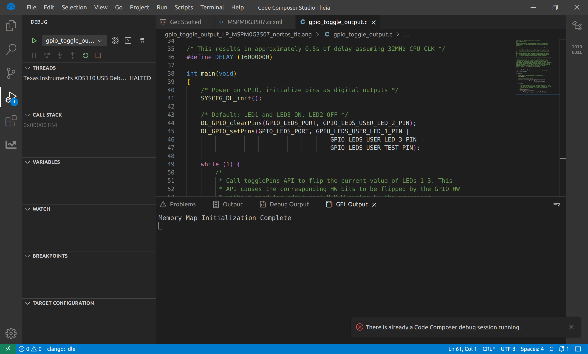

## 可以烧录但无法 Debug：There is already a Code Composer debug session running

### 问题描述

在本地的 CCS-Theia 上，只能烧录一次，后续无法 debug。如果第二次点击 debug 会报错 `There is already a Code Composer debug session running.`

然而，在 [CCS Cloud](https://dev.ti.com/ide) 上，一切都可以正常运行，非常的奇怪。

### 环境

- 单片机：MSPM0-G3507
- 操作系统：Ubuntu-22.04
- CCS-Theia 版本：1.4.1.00001_linux-x64
- 仿真器：XDS110
- MSPM0-SDK:2_01_00_03
- 编译：TI Clang v3.2.2.LTS

基本环境如图所示：

### 具体错误与过程

导入如图所示的示例项目

第一次点击调试后，似乎可以成功烧录，但是调试似乎并不能正常运行。

结束调试会话，出现错误：`Request 2 cancelled on connection close`

再次点击 debug，出现以下错误：
`There is already a Code Composer debug session running.`

重启 CCS-Theia 并没有任何效果，只会周而复始地重复整个过程。

然而，在 CCS Cloud 上，我却可以成功烧录和 debug，只是整个过程比较慢。

事实上，我在 ti 的中文论坛上也找到了类似的问题，但是没什么人回复

[mspm0g3507-ccs-theia-debug](https://e2echina.ti.com/support/microcontrollers/other/f/other-microcontrollers-forum/859832/mspm0g3507-ccs-theia-debug?tisearch=e2e-sitesearch&keymatch=debug#)

[mspm0g3507-debug-there-is-already-a-code-composer-debug-session-running](https://e2echina.ti.com/support/microcontrollers/other/f/other-microcontrollers-forum/860922/mspm0g3507-debug-there-is-already-a-code-composer-debug-session-running?tisearch=e2e-sitesearch&keymatch=debug#)

### 已经尝试的方法

均无明显效果。

- 重启 CCS-Theia
- 重启计算机
- 重新安装 CCS-Theia

### 可能存在的隐患

在我第一次下载 CCS-Theia 时，我在 CCS-Theia 安装完成、并编译项目后，才运行`ccstheia141/ccs/install_scripts/install_drivers.sh`。
我尝试过删除 CCS-Theia 后，先运行`install_drivers.sh`以及`sudo apt install libc6-i386 libusb-0.1-4 libgconf-2-4 libncurses5 libpython2.7 libtinfo`重新安装它，但是并不能保证完全删除干净
我尝试过到`ccstheia141/ccs/ccs_base/common/uscif/xds110`中使用`xds110`程序重新烧录`firmware_3.0.0.29.bin`，似乎也没用处。

如何解决这个问题？非常感谢任何帮助！
