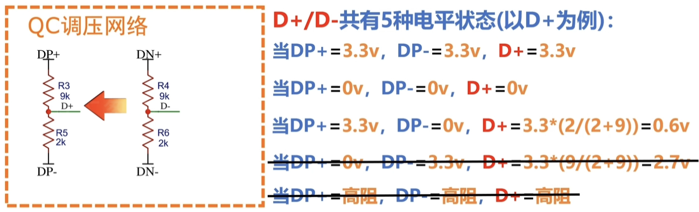
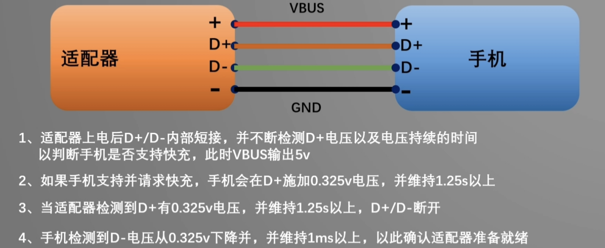
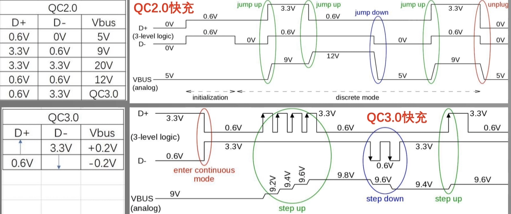
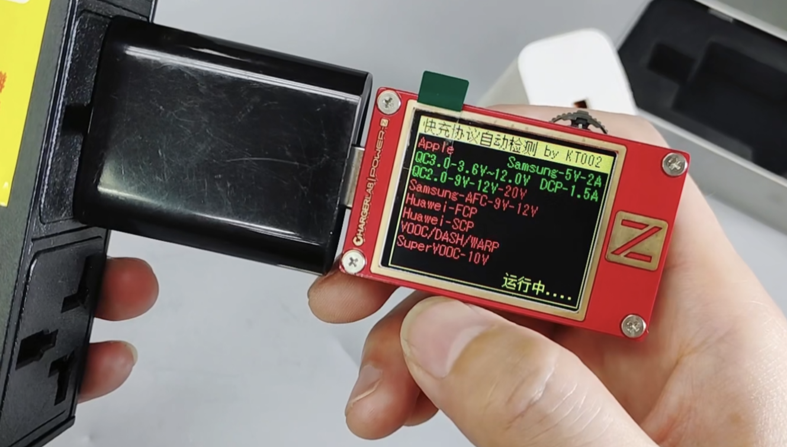
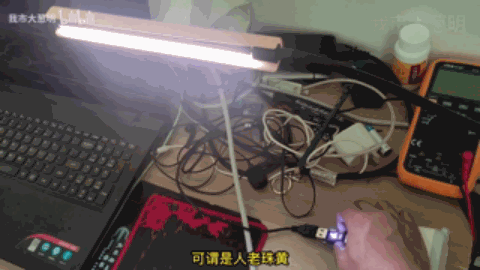

## 充电协议原理、测量与应用

- 常见充电协议
  - 私有协议
  - 公有协议
- QC 充电
  - QC 调压网络-USB 数据线
  - QC 握手过程
  - QC 协议与时序
- USB 测试仪
- QC 诱骗

---

## 常见充电协议

充电协议定义了设备在充电过程中如何与充电器进行通信，以优化充电效率和安全性。

- **标准化**：确保不同设备和充电器之间的兼容性。
- **效率**：提高充电速度，减少充电时间。
- **安全**：防止过充、过热等问题。

### 私有协议

- **小米/红米**：高通 QC 协议、Turbo Charge（小米私有协议）。
- **Apple**：iPhone 8 及以后的手机使用的是 PD 协议。iPhone 8 以前的，使用的是 Apple 2.4A 充电协议。
- **Huawei**：FCP、SCP
- **OPPO**：VOOC、SuperVOOC（两个都是私有协议）。
- **Vivo 和 IQOO**：vivo 超快闪充、vivo 闪充、双引擎闪充（三个都是私有协议）。

---

## 常见充电协议（续）

### 公有协议

- **Qualcomm Quick Charge (QC)**：由高通公司开发的快速充电技术，广泛用于各种设备。
- **USB Power Delivery (USB-PD)**：一种灵活的充电协议，支持更高的功率传输（最高 100W）。
- **Wireless Charging Standards**：如 Qi 标准，用于无线充电。

---

## QC 充电

### QC 调压网络-USB 数据线

- **电压档位**：QC 2.0 支持 5V、9V、12V 等多个电压档位。
- **特点**：通过 USB 数据线进行电压调节，提供更高的充电效率。
  

---

## QC 充电

### QC 握手过程

---

## QC 充电

### QC 协议与时序

---

## USB 测试仪

---

## QC 诱骗

### 概念

通过模拟 QC 协议的握手过程，诱骗充电器提供更高的电压。

### 应用

- **支持旧设备快充**：可以给不支持快充的老旧设备提供快充功能。
- **轻量级适配器**：可以改用轻量级的电源适配器和新型的 Type-C 接口，而不是老旧的 12VDC 接口和砖头大小的适配器。

---

## QC 诱骗

### 应用（续）

### 风险

- **设备过热或损坏**：可能导致设备过热或损坏，不推荐使用。

---

## 参考资料

1. [USB Power Delivery Specification](https://www.usb.org/document-library/usb-power-delivery)
2. [Qualcomm Quick Charge Overview](https://www.qualcomm.com/products/features/quick-charge)
3. [bilibili-{QC 诱骗 2-协议篇}](https://www.bilibili.com/video/BV1V34y1H74F)
4. [嘉立创-{qc 诱骗项目}](https://oshwhub.com/azhannihao/qc-you-pian-mu-kuai-dan-pian-ji-ban)
5. [手机快充协议是什么？一篇文章带你搞懂各个快充协议](https://zhuanlan.zhihu.com/p/557684670)
