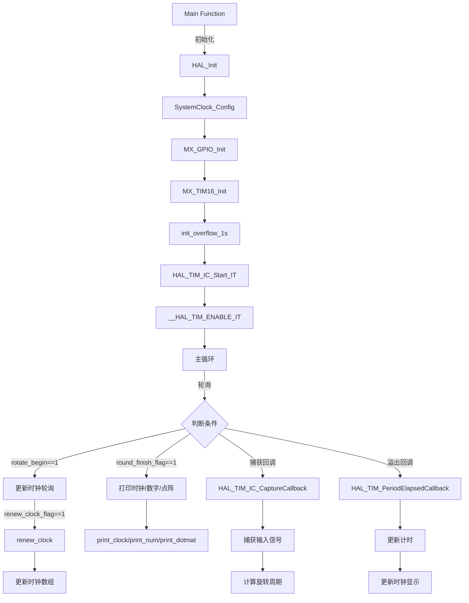

# Project1 - 旋转灯

## hc595 驱动

### 函数：`hc595_send`

此函数将 16 位数据发送到 74HC595 移位寄存器。

```c
void hc595_send(uint16_t data)
{
    for(int i = 0;i < 16;i++)
    {
        HAL_GPIO_WritePin(DS_GPIO_Port, DS_Pin, data & 1<<15 ? GPIO_PIN_SET : GPIO_PIN_RESET);
        HAL_GPIO_WritePin(SHCP_GPIO_Port,SHCP_Pin, GPIO_PIN_SET);
        HAL_GPIO_WritePin(SHCP_GPIO_Port,SHCP_Pin, GPIO_PIN_RESET);
        data <<= 1;
    }
    HAL_GPIO_WritePin(STCP_GPIO_Port,STCP_Pin, GPIO_PIN_RESET);
    HAL_GPIO_WritePin(STCP_GPIO_Port,STCP_Pin, GPIO_PIN_SET);
}
```

---

## 显示点阵

### 点阵数据

点阵数据定义在 `dotfont_lib.h` 中。

### 函数：`print_dotmat`

```c
void print_dotmat(uint16_t **dotmat, uint8_t nums, uint8_t size, int delay);
```

此函数用于显示点阵图案。

- `dotmat`：指向点阵数据的指针数组。
- `nums`：点阵图案的数量。
- `size`：每个点阵图案的大小。
- `delay`：显示每个图案的延时。

---

## 显示数字

### 函数：`print_digit`

```c
void print_digit(uint16_t digit, int delay);
```

此函数用于显示单个数字。参数说明：

- `digit`：要显示的数字（0-9）。
- `delay`：显示数字的延时时间。

```c
void print_digit(uint16_t digit, int delay){
    for(int i=0; i<8; i++){
        hc595_send(NUMBER[digit][i]);
        HAL_Delay(delay);
    }
    hc595_send(0x0000);
}
```

---

### 函数：`print_num`

```c
void print_num(uint16_t num, int delay);
```

此函数用于显示多位数字。参数说明：

- `num`：要显示的数字（如 123）。
- `delay`：显示每位数字的延时时间。

```c
void print_num(uint16_t num, int delay) {
    uint8_t digits[5]; // 最大值 65535，有 5 位
    uint8_t num_digits = 0;
    // 分解数字并存入数组
    do {
        digits[num_digits++] = num % 10;
        num /= 10;
    } while (num > 0);

    // 反向输出数组中的数字
    for (int i = 0; i < num_digits; i++) {
        print_digit(digits[num_digits-i-1], delay);
    }

    hc595_send(0x0000); // 清除显示
}
```

---

## 显示时钟

### 函数：`renew_clock`

```c
void renew_clock(void);
```

此函数用于更新时钟显示数组 `CLOCK`。根据当前时间（小时、分钟、秒），计算并设置时钟各个时间点的显示数据。

```c
void renew_clock(void){
    for (int i = 0; i < 60; i++) {
        CLOCK[i] = 0;
    }
    // 更新时间
    s++;
    if (s >= 60) {
        s = 0;
        m++;
        if (m >= 60) {
            m = 0;
            h++;
            if (h >= 24) {
                h = 0;
            }
        }
    }
    // 设置新的时、分、秒指针位置
    CLOCK[h] = hour_hand;
    CLOCK[m] = min_hand;
    CLOCK[s] = sec_hand;
}
```

---

### 函数：`print_clock`

```c
void print_clock(int delay);
```

此函数按顺序打印时钟数组 `CLOCK` 的内容，参数为延时时间。它会逐个显示时钟的每个时间点，以形成完整的时钟显示效果。

```c
void print_clock(int delay) {
    for(int i=0; i<60; i++){
        hc595_send(CLOCK[i]);
        HAL_Delay(delay);
    }
}
```

---

## 周期等参数的测量：定时器输入捕获

### 函数：`HAL_TIM_PeriodElapsedCallback`

```c
void HAL_TIM_PeriodElapsedCallback(TIM_HandleTypeDef *htim);
```

此回调函数在定时器周期溢出时调用，用于更新计时和时钟显示。它会：

1. 增加 `overflow_cnt` 计数器。
2. 根据计数器值判断是否需要更新时钟显示或执行其他操作。

```c
void HAL_TIM_PeriodElapsedCallback(TIM_HandleTypeDef *htim)
{
    static uint32_t real_overflow_cnt=0;
    if (htim == &htim16)
    {
        overflow_cnt++; // 记录溢出次数
        real_overflow_cnt++;
    }
    if(CLOCK_MODE_ON == 1 && rotate_begin == 1){
        if(real_overflow_cnt % overflow_1s == 0){
            renew_clock_flag = 1;
            elapsed_secs++;
        }
    }
}
```

---

### 函数：`HAL_TIM_IC_CaptureCallback`

```c
void HAL_TIM_IC_CaptureCallback(TIM_HandleTypeDef *htim);
```

此回调函数用于定时器输入捕获，测量旋转周期。具体步骤如下：

1. 捕获输入信号的时间戳，并存储在 `ic_val1` 和 `ic_val2` 中。
2. 计算两个时间戳之间的差值，再根据溢出次数，即可计算旋转周期。

```c
void HAL_TIM_IC_CaptureCallback(TIM_HandleTypeDef *htim)
{
    if (htim == &htim16)
    {
        if(rotate_begin == 0){
            rotate_round++;
            if(rotate_round > round_threshod){
                rotate_begin = 1; // 超过阈值，开始正常计数
                rotate_round = 0; // 清零
            }
        } else {
            round_finish_flag = 1;
            rotate_round++;
            if (captured_once == 0)
            {
                ic_val1 = HAL_TIM_ReadCapturedValue(htim, TIM_CHANNEL_1);
                captured_once = 1;
                overflow_cnt = 0; // 重置溢出计数器
            }
            else
            {
                ic_val2 = HAL_TIM_ReadCapturedValue(htim, TIM_CHANNEL_1);
                difference = ic_val2 - ic_val1 + overflow_cnt * (htim16.Init.Period + 1);
                time_interval = difference / (freq * 1000);
                captured_once = 0; // 重置捕获状态
            }
        }
    }
}
```

---

## 主函数

在主循环中轮询，处理定时器中断更新和显示逻辑。

```c
int main(void)
{
    HAL_Init();
    SystemClock_Config();
    MX_GPIO_Init();
    MX_TIM16_Init();
    init_overflow_1s();
    HAL_TIM_IC_Start_IT(&htim16, TIM_CHANNEL_1);
    __HAL_TIM_ENABLE_IT(&htim16, TIM_IT_UPDATE);
    hc595_send(0xff00); // 仅用于测试

    while (1)
    {
        if(renew_clock_flag == 1){
            renew_clock();
            renew_clock_flag = 0;
        }
        if(round_finish_flag == 1){
            print_clock(time_interval / 60);
            round_finish_flag = 0;
        }
    }
}
```

---


